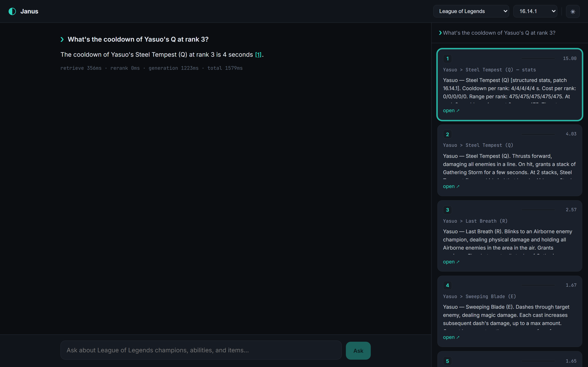

# Janus

[](https://github.com/parthataraf/janus/actions/workflows/tests.yml)

**A grounded, cited knowledge engine for game data, starting with League of Legends.**

Ask Janus about League of Legends (a champion's ability, an item's stats, who
builds armor penetration) and it streams back an answer whose every claim links
to the game data it came from. Exact numbers (cooldowns, gold costs, base stats)
are resolved straight from **structured stat tables**; mechanics and lore go
through **vector + full-text retrieval**, and one router picks the right path per
question. And when the data doesn't cover something, Janus **refuses out loud**
instead of hallucinating.

One hand-rolled RAG engine, built to wear more than one "face" (named for the
two-faced Roman god). **League of Legends is live; Palworld is on the roadmap.**
No LangChain / LlamaIndex; Postgres + pgvector is the only datastore.

**▶ Live demo: [leagueoflegends.polaris-ai.org](https://leagueoflegends.polaris-ai.org)**
&nbsp;·&nbsp; **[GitHub](https://github.com/parthataraf/janus)**
&nbsp;·&nbsp; methodology: **[spec](SPEC.md)** · **[technical reference](docs/TECHNICAL_REFERENCE.md)**



<sub>*Sources-first streaming: the citations panel fills before the answer does. Clicking a citation `[n]` scrolls to its source card with a glow pulse; clicking a card highlights the sentence(s) it supports and dims the rest.*</sub>

---

## What you can ask

Janus is grounded in **League of Legends Data Dragon** (a pinned patch), which it
splits into two kinds of knowledge, and routes each question to the right one:

- **Exact numbers → structured lookup.** *"What is the cooldown of Zed's ultimate
  at rank 1?"*, *"How much gold is Infinity Edge?"*, *"What is Garen's base
  movement speed?"* resolve straight from typed stat tables (`lol_champions` /
  `lol_abilities` / `lol_items`). Prose retrieval can't reliably surface a
  specific number, so it isn't asked to.
- **Set questions → multi-row lookup.** *"Which items give armor penetration?"*
  returns the full set, scored on recall.
- **Mechanics & lore → vector + full-text retrieval.** *"What does Yasuo's passive
  do?"*, *"How does Thresh's lantern work?"* go through hybrid retrieval over the
  embedded champion prose.
- **Off-topic → refusal.** *"How do I bake cookies?"* is refused, not answered.

On a **hand-curated, double-reviewed 32-question** LoL eval set (patch 16.14.1),
generated with **`openai/gpt-4o-mini`** and faithfulness-judged by an
**independent** model (**`google/gemini-2.5-flash`**): numeric structured-lookup
answers are **100% correct** (answer-level = context-level, gap 0), prose
questions hit **100% @5** (MRR 1.000), off-corpus questions are **refused 3 / 3**,
and faithfulness is **4.93 / 5**. That's strong but honest: the structured path
is essentially a typed lookup, so near-perfect *numeric* accuracy is *expected*
(it confirms the router surfaces the exact row and the model states it
faithfully, not a hard-retrieval stress test). The **answer-vs-context gap earned
its keep on multi-row item sets**: the first run retrieved every item (**100%
context**) but the generator *named* only **~74%**; it abbreviated long lists. The
gap caught it, a **scoped exhaustive-enumeration prompt instruction** closed it to
**100% answer-recall / 100% pass** with no regression to numeric or prose, and both
the before and after are kept in the results. The engine's harder retrieval
evaluation is in [Engineering history](#engineering-history-the-fastapi-face)
below. Full LoL breakdown: [`eval/results.md`](eval/results.md) · golden set:
[`eval/testset_lol.jsonl`](eval/testset_lol.jsonl).

> **Patch note.** These numbers were measured on **Data Dragon 16.14.1**. The
> deployed demo serves a **16.15.1** corpus, so a stat the patch changed can read
> differently on the live site than in the results file. The eval set is pinned
> to the patch it was curated and double-reviewed against, and re-running it on a
> new patch means re-reviewing every expected value, not just re-ingesting. Live
> OP.GG stats are a separate path and always reflect the current patch regardless.

## What it does

- **Structured *and* vector routing**: game data has exact numbers prose retrieval can't reliably surface, so numeric questions resolve from typed tables while mechanics/lore run hybrid retrieval; both can feed one grounded generation call.
- **Sources-first SSE streaming**: the `sources` event paints the citations panel *before* any answer token arrives.
- **Two-way citation linking**: `[n]` in the answer ↔ its source card; click either to light up the other.
- **Refusal gate**: below a rerank-score threshold it says "the data doesn't cover this" and never calls the model (no confident hallucination on off-corpus questions).
- **Version-aware ingestion**: the corpus pins a Data Dragon patch and stamps it as `doc_version`, so every answer is traceable to a known version and eval sets don't rot.
- **Provider-agnostic generation**: any OpenAI-compatible endpoint (local llama.cpp or a hosted API) via one config; the refusal path short-circuits before the call.
- **Live meta stats (OP.GG)**: matchup/counter, win-rate, popularity, and **recommended-build** questions (*"who counters Yasuo?"*, *"is Zed strong right now?"*, *"master yi items"*) are answered by **live-querying OP.GG's official MCP per question**, never cached into our own data, always attributed with **source + patch + fetched-at**, framed only as statistical tendencies (never "dodge this game" advice; builds report what players *are* building, not what you *should*), and degrading with a message that names the actual failure (missing data, slow source, or outage) rather than guessing or offering one catch-all excuse.
- **Second face on the roadmap**: the same engine (entity linking, structured+vector routing, refusal gate) is built to take a **Palworld** corpus next; the switcher already shows it as *coming soon*.

## Architecture

```
              INGESTION (offline, per pinned corpus version)
  Data Dragon @ patch ────┐        FastAPI docs @ git tag ─┐
   structured tables +    │         (engineering history)   │
   prose chunks           │          HTML-clean + chunk     │
                          ▼                                   ▼
                 ┌──────────────────────────────────────────────┐
                 │            Postgres 16 + pgvector             │
                 │  chunks(embedding vector(1536), full-text)    │
                 │  lol_champions / lol_abilities / lol_items    │
                 └──────────────────────────────────────────────┘
                                       ▲
   QUERY ─▶ route() ─┬─ [lol] entity-link ─▶ structured lookup ─┐
                     └─ hybrid: vector <=> + full-text ─▶ RRF ─▶ rerank ─┐
                                                                         ▼
                                     refusal gate ◀── top rerank score
                                                                         │ above threshold
                                                                         ▼
                          generation (OpenAI-compatible) ─▶ answer + [n] citations
                                                                         │
             API (FastAPI · SSE) ─▶ Caddy (auto-HTTPS) ─▶ React UI (streamed answer + citations panel)
```

Ingestion writes embedded prose chunks and, for LoL, structured stat tables. A
query is **routed**: LoL numeric questions resolve exact numbers from the tables;
everything else runs hybrid retrieval, dense cosine (`<=>`) plus Postgres
full-text, fused with **Reciprocal Rank Fusion**, then a **cross-encoder
reranker**. The top rerank score gates the refusal. Grounded answers stream over
**SSE, sources-first**, behind **Caddy** to a minimal **React** UI.

## Methodology

Built **spec-first, one phase at a time, each behind a verification gate**, and
**every retrieval-pipeline change is eval-justified, not anecdotal**: the
release-notes filter became the default only after the eval showed +7.8 hit@1
with no metric degraded. The evidence lives in the repo:

- **[`SPEC.md`](SPEC.md)**: the full project specification.
- **[`docs/TECHNICAL_REFERENCE.md`](docs/TECHNICAL_REFERENCE.md)**: component-by-component reference for the post-pivot engine (incl. the golden-set maintenance policy, the retired-face policy, and open items).
- **[`eval/results.md`](eval/results.md)**: the eval numbers and per-config error analysis.
- **[`docs/EVAL_TUNABLES.md`](docs/EVAL_TUNABLES.md)**: per-tunable adopt/reject record behind the pipeline defaults (what was tried, what the eval said, what shipped).
- **[`SPOT_CHECK.md`](SPOT_CHECK.md)**: the manual corpus-audit record (two review rounds).

## Run it locally

Requirements: Docker Desktop (for the pgvector Postgres), Python 3.11+, Node 20+
(frontend). The DB is published on host port **5433** (not 5432) to avoid
colliding with a local Postgres; `.env.example` reflects this.

```bash
# 1. Start the pgvector database
docker compose up -d

# 2. Python deps (a virtualenv is recommended)
pip install -r requirements.txt

# 3. Configure environment (generation endpoint + DB)
cp .env.example .env        # Windows: copy .env.example .env

# 4. Ingest the live corpus (idempotent per version)
python -m ingestion.run_ingest --corpus lol             # defaults to the latest Data Dragon patch
# Optional: the retired FastAPI face (engineering history; hidden from the UI
# by EXCLUDED_CORPORA, but the adapter still works if you want to run the eval):
# python -m ingestion.run_ingest --corpus fastapi --version 0.139.0

# 5. Run the API, then the frontend
uvicorn app.main:app --port 8000
cd frontend && npm install && npm run dev               # http://localhost:5173
```

`python smoke_test.py` runs the Phase-1 embed → store → search check (prints
`SMOKE TEST PASSED`); `python -m pytest` runs the unit tests.

## Deploy

Production stack (`docker-compose.deploy.yml`): Postgres (pgvector) + API +
frontend + **Caddy** (automatic HTTPS). Only Caddy publishes ports; the browser
talks to **one origin**: Caddy serves the frontend and proxies `/api/*` to the
API (stripping the prefix).

- **`Dockerfile.api`**: python-slim, **non-root** (uid 10001), CPU-only torch,
  the **reranker** baked in at build time (no cold download on the first query).
  Since the 2026-07-27 embedding adoption, **no embedding weights ship in the
  image**; embeddings are served by the OpenAI-compatible API, so the image is
  smaller and the embedder is upgraded by config rather than a rebuild. Running
  `EMBED_PROVIDER=local` means a one-time model download on first use (or add it
  to the bake). `git` is included so ingestion can clone the docs repo.
- **`Dockerfile.frontend`**: Vite build → nginx; `VITE_API_BASE=/api` baked in.

### Required environment (server `.env`)

Copy `.env.deploy.example` → `.env` on the server and fill in. `.env` is
gitignored **and** excluded from the Docker build context (`.dockerignore`), so
secrets never enter an image layer.

| Var | Required | Example | Notes |
|---|---|---|---|
| `DOMAIN` | yes | `janus.example.com` | Caddy auto-HTTPS. Local test: `http://localhost` (plain HTTP, no TLS). |
| `POSTGRES_USER` | yes | `rag` | |
| `POSTGRES_PASSWORD` | yes | *(strong)* | **secret** |
| `POSTGRES_DB` | yes | `ragdb` | |
| `OPENAI_BASE_URL` | yes | `https://api.openai.com/v1` | any OpenAI-compatible endpoint |
| `GEN_MODEL` | yes | `gpt-4o-mini` | |
| `OPENAI_API_KEY` | yes | `sk-…` | **secret**; runtime env only |
| `GEN_TIMEOUT` | no *(60)* | `60` | seconds |
| `GEN_MAX_TOKENS` | no *(4096)* | `4096` | ceiling on generated tokens per answer; too low truncates long item lists |
| `CORS_ORIGINS` | yes | `https://janus.example.com` | restrict to your origin |
| `RATE_LIMIT_PER_MIN` | no *(30)* | `30` | per-IP `/ask` limit |
| `MAX_QUESTION_CHARS` | no *(500)* | `500` | longest accepted question; caps the prompt cost of one call |
| `EXCLUDED_CORPORA` | no *(smoke,fastapi)* | `smoke,fastapi` | corpora hidden from the UI switcher (FastAPI is retained in-repo but not surfaced) |
| `EMBED_PROVIDER` | no *(`api`)* | `api` | `api` = OpenAI-compatible `/embeddings`; `local` = sentence-transformers |
| `EMBED_MODEL` | no | `openai/text-embedding-3-small` | must match `EMBED_DIM` |
| `EMBED_DIM` | no *(1536)* | `1536` | pgvector column width; changing it needs `migrate_embeddings` + re-ingest |
| `RERANK_MODEL` | no | `cross-encoder/ms-marco-MiniLM-L-6-v2` | local; must match the baked weights |
| `RERANK_THRESHOLD` | no *(0.0)* | `0.0` | refusal gate |

> ⚠️ **Hard runtime dependency.** With the default `EMBED_PROVIDER=api`, the
> server **cannot retrieve at all** if the embeddings endpoint is unreachable:
> no query vector means no search. This is a total, not partial, failure; the
> keyword leg is never used alone. `/ask` returns an honest *"search is
> temporarily unavailable"* refusal, `/health` reports `embeddings: false` and
> the service goes `degraded`. Budget for it: outbound HTTPS to
> `OPENAI_BASE_URL` must stay open, and the same key now gates **both**
> generation and retrieval. Set `EMBED_PROVIDER=local` (with a
> sentence-transformers `EMBED_MODEL`/`EMBED_DIM`, then migrate + re-ingest) to
> remove the dependency at a cost in retrieval quality.

> 💰 **Cost control on a public deployment.** `GEN_MAX_TOKENS`,
> `MAX_QUESTION_CHARS`, and `RATE_LIMIT_PER_MIN` bound what a single request and a
> single IP can spend. They do not bound *total* spend, and a per-IP limit is easy
> to sidestep. The backstop that cannot be coded around is a cap on the key
> itself: OpenRouter supports a per-key credit limit (`openrouter.ai/keys`),
> readable at runtime from `GET /api/v1/key`. Give a public demo its own capped
> key rather than one shared with development.

### VPS: start to finish

1. **Provision** the cheapest Hetzner/DigitalOcean VPS (2 vCPU / 4 GB is
   comfortable, since the reranker is a CPU model and embeddings are hosted). Ubuntu 22.04+.
2. **DNS**: add an `A` record for `DOMAIN` → the VPS IP *before* bringing the
   stack up, so Caddy can obtain a certificate.
3. **Install Docker** (includes the compose plugin):
   ```bash
   curl -fsSL https://get.docker.com | sh
   ```
4. **Clone + configure**:
   ```bash
   git clone https://github.com/parthataraf/janus.git && cd janus
   cp .env.deploy.example .env
   nano .env   # DOMAIN, POSTGRES_PASSWORD, OPENAI_*, CORS_ORIGINS=https://<DOMAIN>
   ```
5. **Build + start**:
   ```bash
   docker compose -f docker-compose.deploy.yml up -d --build
   ```
6. **Ingest** the live corpus into this stack's own DB (one-off; idempotent).
   The product ships the **League of Legends** face only; the FastAPI corpus
   stays in the repo as engineering history but isn't ingested or surfaced:
   ```bash
   docker compose -f docker-compose.deploy.yml run --rm api \
       python -m ingestion.run_ingest --corpus lol
   ```
7. Open `https://<DOMAIN>` and ask a question. Firewall: open **80 and 443**
   inbound. The API also needs **outbound HTTPS to `mcp-api.op.gg`** (the live
   OP.GG stats path) and to the generation endpoint, so allow outbound 443. On
   startup the API **pre-warms** OP.GG's compute for common champions (best-effort,
   non-blocking, nothing stored), so the first live queries are fast. A timeout is
   retried once automatically; anything that still fails degrades to a message
   naming that specific failure (no data for this champion / slow / warming up /
   unavailable) rather than one catch-all.
8. **Go-public swap**: ✅ **done** for `leagueoflegends.polaris-ai.org`. The
   shared-link metadata in `frontend/index.html` (`og:url`, `og:image`,
   `twitter:image`) and the live-demo link above both point at it. If you ever
   move domains, change those four values, and remember the preview image is
   served from this origin (`frontend/public/janus-lol.png` → dist root), so it
   moves with you. Rebuild the frontend after any change so the meta ships: the
   tags are in the HTML shell, not the JS bundle.

### Ops

- **Logs** (JSON request lines with per-stage latency):
  `docker compose -f docker-compose.deploy.yml logs -f api`
- **Health**: `docker compose -f docker-compose.deploy.yml ps`. The `api`
  service has a healthcheck hitting `/health` (DB + embeddings reachability +
  reranker + generation endpoint). Under `EMBED_PROVIDER=api` the embeddings
  check is a live probe, so `/health` turns `degraded` during an embedding
  outage, which is also when `/ask` starts refusing.
- **Update**: `git pull && docker compose -f docker-compose.deploy.yml up -d --build`.
- The `pgdata` volume and Caddy certs persist across restarts. Re-run an ingest
  command only when bumping a corpus version.

## Design decisions

- **pgvector, one datastore**: vectors, full-text, metadata, and the LoL
  structured tables all live in one Postgres; no extra moving parts to operate.
- **No RAG framework**: hand-rolling loaders, chunking, retrieval, and the SSE
  layer is the point; nothing important is hidden behind an abstraction.
- **RRF over weighted score-mixing**: cosine similarity and `ts_rank` live on
  incomparable scales, so hybrid search fuses by *rank* (Reciprocal Rank Fusion),
  not by mixing raw scores.
- **Version-pinned corpora**: an answer is only trustworthy if you know which
  version produced it, so ingestion pins the git tag / Data Dragon patch and
  stamps it as `doc_version`; eval sets version-lock to it so results don't rot.
- **Structured *and* vector routing**: game data has exact numbers prose
  retrieval can't reliably surface, so LoL numeric questions resolve from typed
  tables while mechanics/lore go through hybrid retrieval, and both can feed one
  generation call.
- **Provider-agnostic generation**: the OpenAI SDK's `base_url` makes local
  llama.cpp and hosted APIs a config change, decoupling retrieval quality from
  any one model.
- **Eval-justified changes**: pipeline defaults move only when a hand-labeled
  eval says so (the release-notes filter shipped; a code-chunk rerank margin and
  `top_n=8` were tried and rejected).

## Engineering history: the FastAPI face

Before the LoL face, the engine was built and hardened on a **technical-docs
corpus: the FastAPI documentation**. That corpus is where the retrieval stack was
actually stress-tested (prose-only, no structured shortcut) and where the
eval-driven methodology was established. **The FastAPI face is retired from the
product** (hidden from `/corpora` via `EXCLUDED_CORPORA`) **but retained in the
repo**: the ingestion adapter, the pinned corpus, and the golden set all still
work, and this is the harder retrieval number.

On a **hand-labeled, double-reviewed 54-question** FastAPI eval set, the retrieval
stack, hybrid (dense + full-text, RRF) plus cross-encoder reranking with an
**eval-driven release-notes filter**, reaches **74.5% hit@1 / 0.837 MRR**, scores
**4.39 / 5** faithfulness (LLM-as-judge), and **refuses 3 / 3 off-corpus**
questions. The release-notes filter alone was worth **+7.8 pts hit@1**, and it
became the default *because the eval justified it*, not on a hunch.

| Config (FastAPI corpus) | hit@1 | hit@3 | hit@5 | MRR |
|---|---|---|---|---|
| vector-only | 72.5% | 90.2% | 96.1% | 0.814 |
| hybrid (RRF) | 66.7% | 90.2% | 94.1% | 0.779 |
| hybrid + rerank | 66.7% | 92.2% | 96.1% | 0.797 |
| **+ release-notes exclusion (default)** | **74.5%** | **92.2%** | **96.1%** | **0.837** |

Full table, faithfulness, and per-config error analysis: [`eval/results.md`](eval/results.md)
· golden set: [`eval/testset_fastapi.jsonl`](eval/testset_fastapi.jsonl)
· corpus audit: [`SPOT_CHECK.md`](SPOT_CHECK.md).

## Caveats & error analysis

- **Stub pages can't be answered from the corpus.** Some FastAPI docs pages are
  thin redirect stubs: mostly external links, not prose (e.g.
  `/how-to/testing-database/` points at the SQLModel docs). A question whose only
  correct source is such a page is unanswerable *by construction*, not a
  retrieval bug; one draft eval question was cut during curation for exactly this
  reason, and the class is tracked so it isn't miscounted as a miss.
- **Faithfulness is scored by a small quantized judge** (phi-4-Q4_K_M): treat
  4.39/5 as directional, not a gold metric.
- **Citation formatting is model-dependent**: smaller local models emit `[n]`
  markers inconsistently; citation parsing degrades gracefully (an answer without
  inline links is fine; a crash is not).

## Repo map

| Path | Purpose |
|---|---|
| `core/` | The engine: `config`, `embeddings`, `chunking`, `store` (pgvector + `lol_*` tables), `retrieval` (hybrid + rerank + `route`), `lol_routing`, `generation` |
| `ingestion/` | `fastapi_docs` (MkDocs), `lol_datadragon` (Data Dragon), `run_ingest` |
| `app/` | FastAPI service: sources-first SSE `/ask`, `/corpora`, `/health`, rate limit, request logging |
| `frontend/` | Vite + React UI: streamed answer, citations panel, corpus/version switcher |
| `eval/` | `evaluate.py`, versioned test sets, `results.md`, the judge prompt |
| `deploy/` | `Caddyfile` (Dockerfiles + `docker-compose.deploy.yml` at the root) |
| `smoke_test.py` | Phase-1 end-to-end check |
